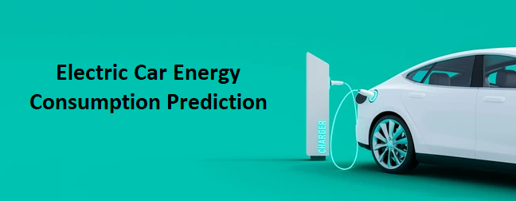
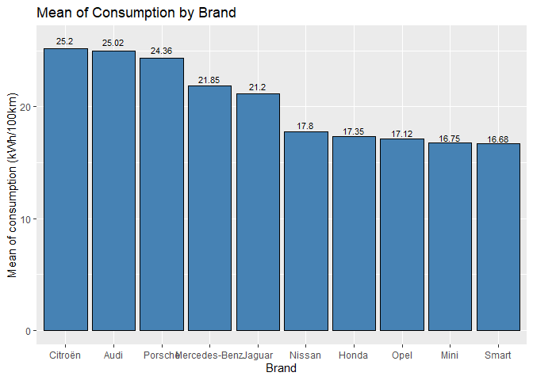
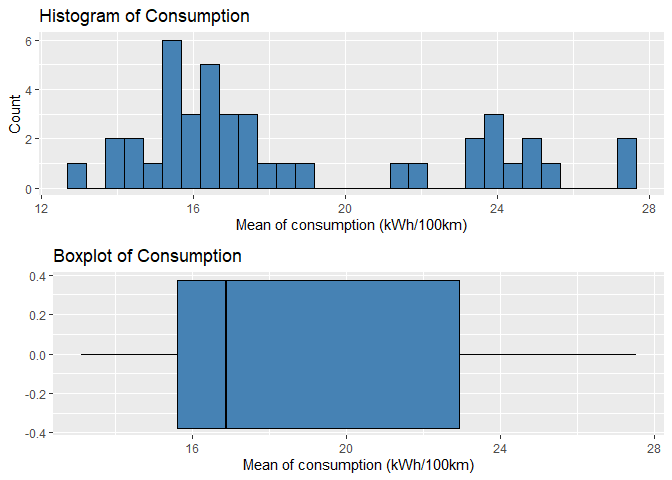
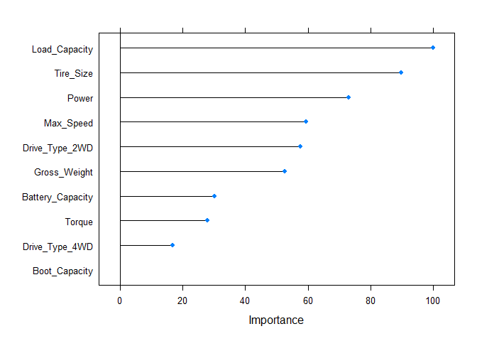
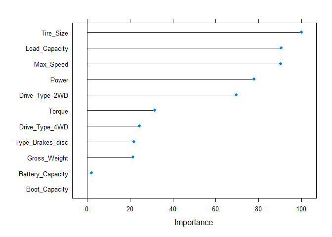

 

# Prediction of Energy Consumption of Electric Cars

**This is part of the first training course of https://www.datascienceacademy.com.br/ Data Scientist program.**

 

# Definition

The current project consisted of creating a machine learning model to
predict the **energy consumption of electric cars**.

# Dataset

The public dataset, available on
<https://data.mendeley.com/datasets/tb9yrptydn/2>, lists attributes of
electric passenger cars collected on specialized websites in Poland.

| **Feature Name**              | **Description**                         |
|-------------------------------|-----------------------------------------|
| **Car full name**             | Car full name                           |
| **Make**                      | Car brand                               |
| **Model**                     | Car model                               |
| **Minimal price**             | Car minimal price (gross PLN)           |
| **Engine Power**              | Engine power (kM)                       |
| **Type of brakes**            | Type of brakes                          |
| **Drive type**                | Car drive type                          |
| **Battery capacity**          | Car battery capacity (kWh)              |
| **Range**                     | Car range (WLTP km)                     |
| **Wheelbase**                 | Car wheelbase distance (cm)             |
| **Length**                    | Car length (cm)                         |
| **Width**                     | Car width (cm)                          |
| **Height**                    | Car height (cm)                         |
| **Minimal empty weight**      | Car minimal empty weight (kg)           |
| **Permissable gross weight**  | Permissable gross weight (kg)           |
| **Maximum load capacity**     | Car maximum load capacity (kg)          |
| **Number of seat**            | Number of seats                         |
| **Number of doors**           | Number of doors                         |
| **Tire size**                 | Car tire size (in)                      |
| **Maximum speed**             | Maximum speed achieved by the car (kph) |
| **Boot capacity**             | Car boot capacity (VDA l)               |
| **Acceleration 0-100 kph**    | Time to reach 100 kph from 0 (s)        |
| **Maximum DC charging power** | Maximum charging power DC (kW)          |
| **Energy consumption**        | Mean energy consumption (kWh/100 km)    |

# First Analysis: Dropping missing values

## Exploratory Analysis

### Mean of `Consumption` by categorical features

* Relation between `Consumption` and `Brand`

 

By this graph plot, we could categorize the top 10 `Brands` with the
**highest mean of `Consumption`** and verify that there were significant
difference among them. However, due to the reduced number of
observations in this dataframe, we should use this information with
caution.

* Relation between `Consumption` and `Type_Brakes`

 

The difference in the median of the two `Types_Brakes`, in terms of
`Consumption` **didn’t seem to be significant**, even though the
difference in the pattern of the data (once again, we have to consider that
we had more examples of one category).

* Relation between `Consumption` and `Drive_Type`

 

We could identify a clear possibility of the 4WD `Drive_Type` to be
**statistically different** from the other two categories, indicating
that this feature might be a good predictor for the model.

### Histogram + Boxplot of `Consumption`

 

The histogram of `Consumption` indicated that this features **did not
follow a normal distribution**. The bulk of data were concentrated on
**smaller values of `Consumption`**, even though both, histogram and
boxplot, showed a distortion towards highest values.

## Splitting data

From our exploratory analysis, we decided to choose the following
features as input to our regression prediction model: `Power`, `Torque`,
`Drive_Type`, `Battery_Capacity`, `Gross_Weight`, `Load_Capacity`,
`Tire_Size`, `Max_Speed` and `Boot_Capacity`. As we previously
concluded, the other features either had multicollinearity or were
already represented by the chosen ones.

## Standardizing data

Before the process of training we needed to perform stardardization of the
features, so that we **prevented features with wider ranges from
dominating others**. For this purpose, we took the mean and standard
deviation from the training set and used them to stardardize both, the
training and test set.

## Choosing and training models

For our regression project, we decided to test the following machine
learning models: **Linear Regression**, **Ridge Regression**, **Random
Forest** and **XGBoost**.

For our first running, we considered all the previously selected
features, which were trained across a 5-fold-cross validation method (in
order to avoid randomness of evaluation).

## Evaluating models

Our main objective for this project was to deliver a model that will be
used to predict the Energy Consumption of electrical cars.

In this case, we were concerned in reducing the error of our model. Three
metrics were used to evaluate the result: **R²** or coefficient of
determination, which is the proportion of the variance for a dependent
variable that is explained by independend variables; **MAE** or mean
absolute error, which is the average absolute error between actual and
predicted values; **RMSE** or root mean square error, which is the
starndard deviation of the residuals (prediction errors).

All the models tested presented similar values for R² metric, while
XGBoost and Random Forest showed slight better values for RMSE and MAE
metrics, for the test set. However, when looking at the training results
we saw that Randon Forest model didn’t present the same performance.
Ridge Regression was able to perform better for the training set but
didn’t improve the results for the test set compared to Linear
Regression not regularized. As for XGBoost, it did achieve a set of
parameters that elevated the performance for the training and test set.
XGBoost requires, however, more computational power and brings
complexity to the model; Linear Regression model, on the other hand, is
a simpler and faster algorithm that showed good performance and
consistence for our dataset, this is why we decided to follow with the
**Linear Regression** model.

## Ranking features by importance

 

As we could see, the feature `Boot_Capacity` seemed to have a smaller
effect on the prediction model. For this reason, we did not consider it
in our final model.

## Optmizing model

We were able to keep up our performance while we reduced dimensionality
of the final model.

# Second Analysis: Inputting missing values

## Treating `Gross_Weight`

In our previous exploratory analysis we could observe a high positive
correlation between `Gross_Weight` and `Minimal_Weight`. The
permissable gross weight was probably derived from the minimal empty
weight. 

In fact, the ratio (Gross_Weight /
Minimal_Weight) seemed to be a constant value over the
observations: both mean and median were similar, while the standard
deviation was not relatively high. **We used the mean of that ratio to
replace missing values in our `Gross_Weight` feature**.

## Treating `Load_Capacity`

Although the standard deviation looked higher than the previous
situation, we decided to follow the same strategy, that is, **We used
the mean of the ratio to replace missing values in the `Load_Capacity`
feature**

## Treating `Consumption`

In order to replace missing values for the `Consumption` feature, we
**made use of our prediction model trained in the first analysis**. We
needed to remind to use the same predictor features and standardize the
data with the same values used before.

## Treating other NA values

We decided to **simply omit the remaining missing values**, as they
didn’t represent a great part of our dataset anymore.

## Evaluating models

Based on the results obtained, and to be consistent with what we
previously determined, we decided to choose **Linear Regression** as our
prediction model.

## Ranking features by importance

 

We had two features, `Battery_Capacity` and `Boot_Capacity`, with
higher p-values. This way, for our optimized model we decided to exclude
them from our predictor features.

# Final considerations

- By inputting missing values in our dataset we were able to outperform
  our first prediction model. Our chosen model would be, then, a
  **Linear Regression** with the following metrics: **R² = 0.94**, **MAE
  = 0.89** and **RMSE = 1,20**. Having the mean of `Consumption` from
  our initial dataset as a basis, we obtained a model that achieved
  around 5% of error (in terms of MAE) in its predictions.

- Some extra improvements can be studied, such as the use of other set
  of features, other algorithms and also by making feature engineering
  in the dataset.

- The model is now ready to be deployed to operational usage.
