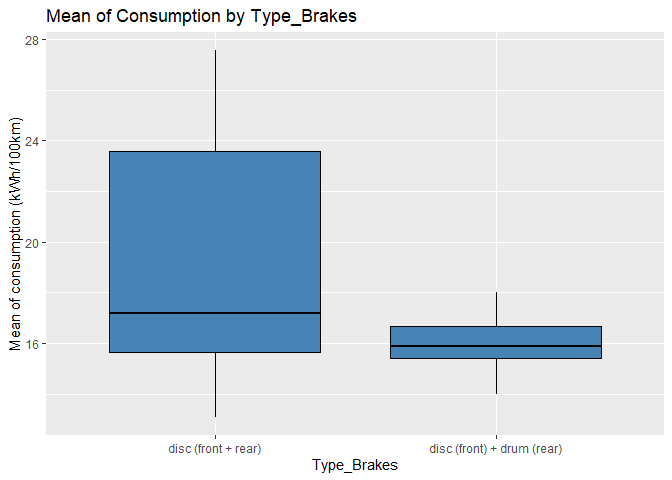
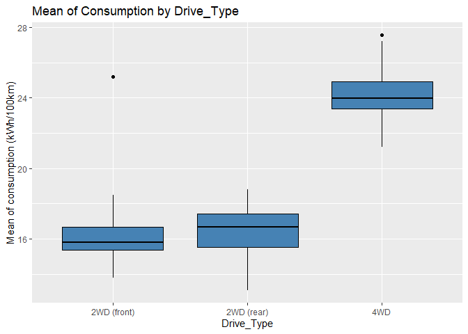
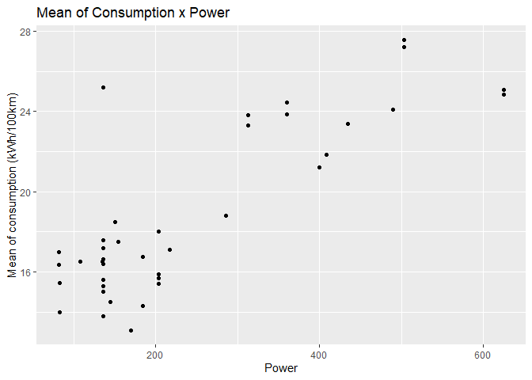
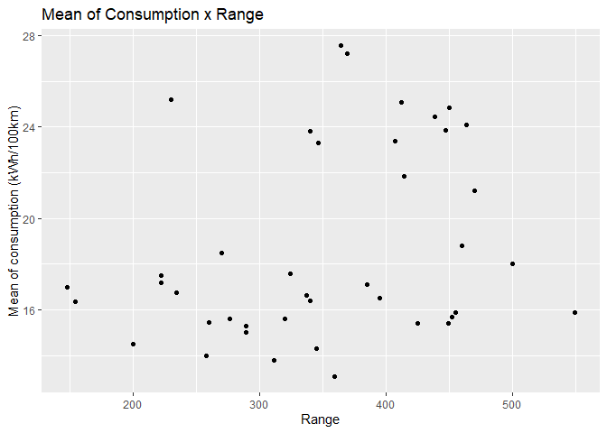
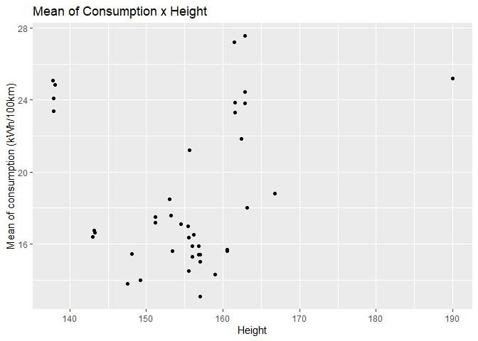
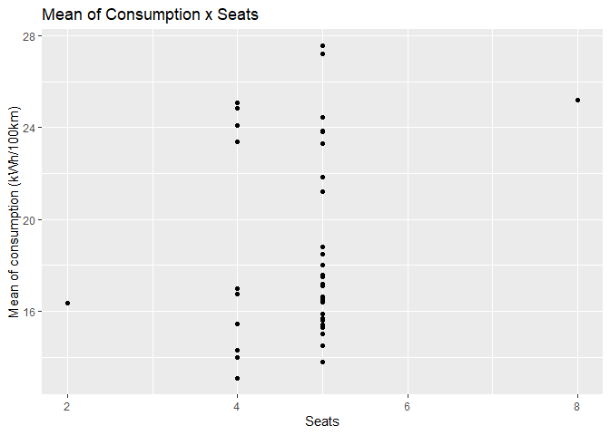
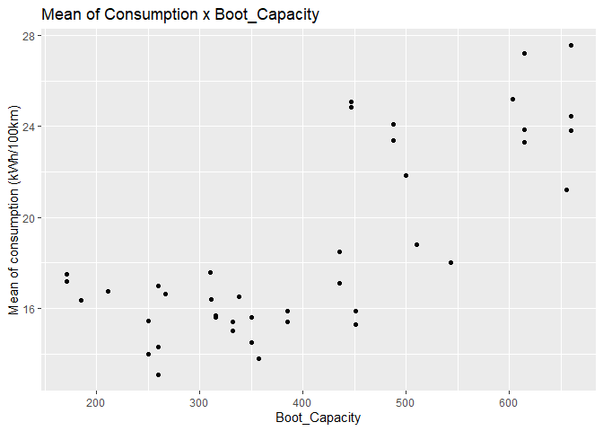
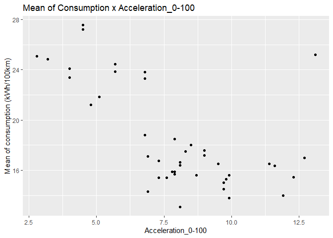
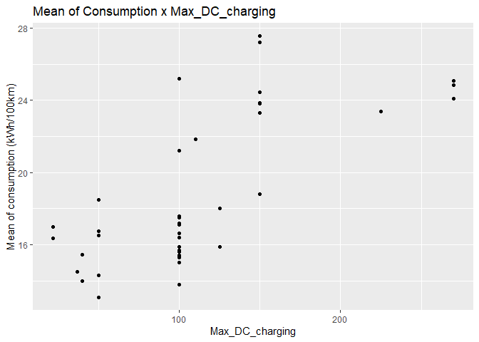

# Prediction of Energy Consumption of Electric Cars

**This is part of the first training course of https://www.datascienceacademy.com.br/ Data Scientist program.**

 

# Definition

The current project consists of creating a machine learning model to
predict the **energy consumption of electric cars**.

# Dataset

The public dataset, available on
<https://data.mendeley.com/datasets/tb9yrptydn/2>, lists attributes of
electric passenger cars collected on specialized websites in Poland.

| **Feature Name**              | **Description**                         |
|-------------------------------|-----------------------------------------|
| **Car full name**             | Car full name                           |
| **Make**                      | Car brand                               |
| **Model**                     | Car model                               |
| **Minimal price**             | Car minimal price (gross PLN)           |
| **Engine Power**              | Engine power (kM)                       |
| **Type of brakes**            | Type of brakes                          |
| **Drive type**                | Car drive type                          |
| **Battery capacity**          | Car battery capacity (kWh)              |
| **Range**                     | Car range (WLTP km)                     |
| **Wheelbase**                 | Car wheelbase distance (cm)             |
| **Length**                    | Car length (cm)                         |
| **Width**                     | Car width (cm)                          |
| **Height**                    | Car height (cm)                         |
| **Minimal empty weight**      | Car minimal empty weight (kg)           |
| **Permissable gross weight**  | Permissable gross weight (kg)           |
| **Maximum load capacity**     | Car maximum load capacity (kg)          |
| **Number of seat**            | Number of seats                         |
| **Number of doors**           | Number of doors                         |
| **Tire size**                 | Car tire size (in)                      |
| **Maximum speed**             | Maximum speed achieved by the car (kph) |
| **Boot capacity**             | Car boot capacity (VDA l)               |
| **Acceleration 0-100 kph**    | Time to reach 100 kph from 0 (s)        |
| **Maximum DC charging power** | Maximum charging power DC (kW)          |
| **Energy consumption**        | Mean energy consumption (kWh/100 km)    |

# First Analysis: Dropping missing values

## Exploratory Analysis

### Mean of `Consumption` by categorical features

* Relation between `Consumption` and `Brand`

 

By this graph plot, we could categorize the top 10 `Brands` with the
**highest mean of `Consumption`** and verify that there are significant
difference among them. However, due to the reduced number of
observations in this dataframe, we should use this information with
caution.

* Relation between `Consumption` and `Type_Brakes`

 

The difference in the median of the two `Types_Brakes`, in terms of
`Consumption` **doesn’t seem to be significant**, even though the
difference in the pattern of the data (again, we have to consider that
we have more examples of one category).

* Relation between `Consumption` and `Drive_Type`

 

We can identify a clear possibility of the 4WD `Drive_Type` to be
**statistically different** from the other two categories, indicating
that this feature might be a good predictor for the model.

### 7.1.2 Mean of `Consumption` by numerical features

* Relation between `Consumption` and `Price`

 

In general, the **higher the `Price`, the higher the mean of
`Consumption`**. For smaller Prices though, there isn’t a clear
tendency. The relation between `Price` and the other numerical features
will be plot in the sequence.

* Relation between `Consumption` and `Power`

 

`Power` has a **positive correlation** with the mean of `Consumption`.

* Relation between `Consumption` and `Torque`

 

Similarly to `Power`, the graph plot indicates that **the higher the
`Torque`, the higher the `Consumption`**. In fact, `Power`and `Torque`
might have a high correlation between each other and this relation will
be examined later.

* Relation between `Consumption` and `Battery_Capacity`

 

It’s possible to see a **positive correlation between `Battery_Capacity`
and `Consumption`**.

* Relation between `Consumption` and `Range`

 

In this case, there isn’t a **clear tendency between the feature `Range`
and the car `Consumption`**.

* Relation between `Consumption`, `Wheelbase`, `Length`, `Width` and
  `Height`
  

 

  

  

  
 
 It seems that, related to the car dimensions, **the higher that
dimension, the higher the car `Consumption` (except for the feature
`Height`)**.

* Relation between `Consumption`, `Minimal_Weight` and `Gross_Weight`

 

  

As expected, **higher values of `Weight` are associated to higher
`Consumption`**. Both graph plots have similar behavior, for this reason
the relation between these two features, along with the other
dimensions, will be examined later.

* Relation between `Consumption` and `Load_Capacity`

 

Once again, we observe a **positive correlation** between the
`Load_Capacity` of a car and its `Consumption`.

* Relation between `Consumption`, `Seats`, `Doors` and `Tire_Size`

 

  

  

Among these three features, only `Tire_Size` **might be a good
predictor** for `Consumption`.

* Relation between `Consumption`, `Max_Speed` and `Acceleration`

 

  

Both features seem to have **good positive correlation with
`Consumption`**. Nevertheless it’s important to consider a
multicollinearity between these two variables, since they represent
essencially the same result.

* Relation between `Consumption` and `Boot_Capacity`

 

Once again, it’s possible to affirm that **the higher the
`Boot_Capacity`, the higher the car `Consumption`**.

* Relation between `Consumption` and `Maximum_DC_Charging Power`

 

Although the feature has apperentaly **good positive correlation with
`Consumption`**, it’s important to extend our study on this variable,
specially comparing it to `Battery_Capacity` in order to avoid eventual
interference in the quality of our prediction model.
